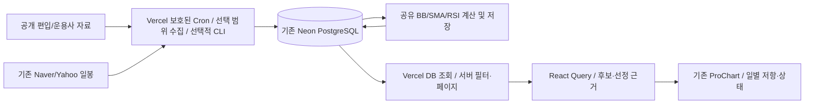

# Bollinger Screener 2.0 — 구현·운영·검증 보고서

최신 확인일: 2026-10-09 한국시간. 이번 실행 UI 수정의 기준 커밋: `962e1fb`. 초기 구현 기준: `4fc2d9e7c23e7d41b159a2d1032fe06c312e9d40`.

**2026-10-06 사용자 Neon 화면에서 9개 테이블과 `migration_recorded=t`를 확인했고, 2026-10-09 운영 화면에서는 편입 2,483행, 가격 20개, 계산 20개가 표시되었다.** 사용자가 선택한 Top100과 서버 예약의 기본 Top20이 연결되어 있지 않아 100개 중 20개 자료만 조회된 것이 확인된 문제다. 이전의 “상대 강도 재계산 중” 문구는 마지막 저장 단계였으며 현재 실행 프로세스가 살아 있다는 증거가 아니었다. 이번 수정은 명시적인 **실행**, **선택 범위 수집·계산**, **수집 이어받기**와 실제 lease에 따른 진행 상태를 추가한다. 운영 데이터 전체·재시작 보존·최신 수정의 배포 성공은 위 캡처만으로 확정하지 않는다. 기존 키움 수집기, 자격증명, 세 지표, SMA, BB, 차트 표시와 저장 설정은 유지한다. 새 스크리너는 공개 가격 자료를 사용하며 키움 자격증명을 요구하지 않는다. 최신 검사 기록은 [BOLLINGER_EXECUTION_VERIFICATION.md](BOLLINGER_EXECUTION_VERIFICATION.md)를 참고한다.

## 1. 저장소 감사와 기존 문제

기존 `ProChart`, `analyzeBollinger`, `bollinger()`, `sma()`, Wilder RSI, 피벗 함수, `getSql()`, TanStack 서버 함수, 관심종목 저장, ETF 공식 PDF 파서, 알림 ledger를 재사용한다. React/TanStack Start/Lightweight Charts나 DB/ORM을 교체하지 않았다.

기존 `/bollinger`는 직접 입력/관심종목 일부를 최대 10개 조회하고 가격 이력을 요청하는 수동 진단이었다. 일반 Setup Quality는 상승/하락 모두의 설정 품질에 점수를 주므로 롱 투자 후보의 주 순위로 적합하지 않았다. 기존 방식의 기능은 `BollingerManualDiagnostic`에 보존하여 명시적으로 열고 실행할 수 있다. 새 기본 검색은 이 경로를 호출하지 않는다.

## 2. 투자 목적·공개 원칙·앱 휴리스틱

목적은 **상승 추세에서 변동성과 거래량이 압축되고, 인과적으로 알려진 저항 아래에 있는 돌파 전 후보**를 찾는 것이다. ARMED는 매수 주문/권고가 아니고, Long Readiness는 기대수익·수익확률이 아니다.

Fidelity/Bollinger의 공개 설명에 대응하는 관례는 BB20/SMA 중심/2 표준편차, 좁아진 밴드의 방향 중립성, 단순 밴드 접촉만으로 매수·매도를 확정하지 않는다는 점이다. BBW/%B 공식과 모집단 표준편차는 기존 공유 엔진을 그대로 쓴다.

BlackRock/J.P. Morgan/Schwab에서 널리 논의되는 시장 환경, 상대 모멘텀, 확인, 위험과 독립 표본 검증이라는 공개 연구 접근을 참고한다. **아래 점수·임계값·상태 조합은 이 앱의 휴리스틱이며 해당 회사의 독점 모델, 인증된 전략, 수익 예측 공식을 구현했다고 주장하지 않는다.** 이번 작업에서 아래 교육/연구 페이지의 최신 본문을 실시간 대조했다는 주장은 하지 않는다.

- [Fidelity: Bollinger Bands](https://www.fidelity.com/learning-center/trading-investing/technical-analysis/technical-indicator-guide/bollinger-bands)
- [StockCharts: Bollinger BandWidth](https://chartschool.stockcharts.com/table-of-contents/technical-indicators-and-overlays/technical-indicators/bollinger-bandwidth)
- [BlackRock 공개 인사이트](https://www.blackrock.com/us/individual/insights)
- [J.P. Morgan 공개 인사이트](https://am.jpmorgan.com/us/en/asset-management/adv/insights/)
- [Schwab 교육](https://www.schwab.com/learn)

## 3. 계산·점수·상태

계산 버전은 `long-daily-2.0.0`. 숫자 범위 검증을 통과한 변경 기준은 결정적으로 인코딩된 별도 버전이 되어 저장/쿼리/이벤트 키에 들어간다. 고급 기준에서 BBW/%B/거리/RSI/건조/돌파 RVOL/RS/Coverage/시장·섹터 필수를 편집하고 공개 설정 JSON을 다운로드할 수 있다. 이 초안은 선택한 저장 버전이 바뀔 때만 초기화되며 기존 사용자 차트 설정을 지우지 않는다. 권장 기본값 복원도 제공한다. `--config`의 값은 새 precompute에 적용하며 화면 필터가 이전 계산값을 새 기준으로 위장하지 않는다.

- 완료 일봉만 사용. 혼합 분봉 문자열·존재하지 않는 날짜를 거부한다. 공급자 행 순서는 정렬하고 날짜 중복은 마지막 유효 관측으로 정리한다.
- BB20/2, 실제 BBW의 125개 유효 표본 mid-rank 분위수, SMA20/60/120/200, RSI14를 기존 엔진에서 계산한다. 워밍업 전 값은 null이다.
- 저항은 **현재 봉 이전**에 우측 3봉 확인이 끝난 고점 피벗을 최근 60봉 범위에서 사용한다. 없으면 현재 봉을 제외한 prior high(최소 20봉)를 사용한다. 현재 고가를 저항에 포함하지 않는다.
- RS20/63은 같은 시장 거래일의 종목 20/63봉 수익률 − 시장 벤치마크 수익률(pp)이다. RS 분위수는 같은 시장의 가용 종목 최소 5개에 대한 mid-rank다. 샘플이 부족하면 null.
- 거래량 건조는 최근 5개 유효 RVOL의 중앙값이다. 강한 건조 ≤0.75, 기본 건조 ≤0.9. 유효 0과 누락은 구별한다.
- 유동성은 실제 20봉 평균 수량과 종가×수량 추정 거래대금이다. 체결별 거래대금으로 표시하지 않는다. 최소 수량/거래대금/시가총액 기본값 0은 별도 최소 규모 배제를 하지 않는다는 뜻이다. 양의 시가총액 최소값을 설정했는데 cap이 없으면 통과시키지 않는다.

| Long Readiness 구성 | 최대 | 계산 의미 |
| --- | ---: | --- |
| 시장 환경 | 7.5 | 벤치마크 SMA200 위, 기울기, 20/63봉 양의 수익률 |
| 섹터 환경 | 7.5 | 섹터 중앙값 20/63봉 수익률이 시장보다 강함 |
| 롱 추세 | 20 | 종가>SMA200, 5봉 기울기, 선호 정배열; 약세에 같은 점수 부여 안 함 |
| 변동성 압축 | 20 | 실제 BBW 분위수 ≤5/10/20 |
| 돌파 전 위치 | 20 | 인과적 저항 아래 거리 0–5%, %B 0.65–0.95 |
| RSI 모멘텀 | 7.5 | RSI50–68 및 상승 |
| 시장 대비 RS | 7.5 | RS20/63 양수 |
| 거래량 건조 | 10 | 유효 RVOL 중앙값 |

`Long Readiness = earned / available × 100`, `Coverage = available / 100`. 미확보 구성은 null이며 분모에서 제외한다. RS 기준 기본 0pp를 변경할 수 있고, 시장/섹터 필수 gate는 기본 OFF(가용성과 점수로 반영)다. ON이면 시장 SMA200 위·비하락 / 섹터 상대강도 조건이 가용해야 한다. Coverage 기본 최소 80%를 충족하지 못한 점수는 기본 롱 후보로 확정하지 않는다.

상태: WARMUP → WATCH → ARMED → TRIGGERED → FOLLOW_THROUGH 또는 FAILED. 조건이 사라지면 NEUTRAL/WATCH로 돌아갈 수 있다.

- ARMED: 완료 가격·거래량·SMA200/BBW 가용, bullish, squeeze≤10, 거리/%B/RSI/건조 조건, score≥70, coverage≥0.8, 과도 확장 아님.
- TRIGGERED: 직전 WATCH/ARMED의 알려진 저항을 **완료 종가**가 돌파하고 RVOL≥1.5. 꼬리만 넘으면 확인 돌파 아님. 직전 압축·Readiness와 돌파 경계를 고정 저장한다.
- FOLLOW_THROUGH: 고정 경계 위의 다음 완료봉 유지, 1/3/5/10봉 확인 기록. 10봉 이후 무기한 유지하지 않는다.
- FAILED: 돌파 다음 1–3봉 내 경계 아래 종가. 이벤트를 매 봉 반복 발행하지 않는다.
- Already Extended: 저항 대비 과도 확장, %B>1.2, SMA20 대비 >10%, RSI>75 등을 경고하고 사전 돌파 후보에서 제외한다.

8개 화면은 Long Pre-Breakout(기본), Squeeze Watch, Triggered, Follow-Through, Failed Breakout, Pullback, Mean Reversion, Bear/Breakdown이다. Bear/Breakdown은 롱 기본 순위와 분리한다. 모든 전략이 별개의 검증된 수익 모델이라는 뜻은 아니다.

## 4. 유니버스·ETF·섹터·신선도

| 범위 | 현재 구현된 수신/입력 | 한계 |
| --- | --- | --- |
| KOSPI/KOSDAQ | Naver market-value 전체 페이지, 공개 totalCount까지 확인 | 현재 편입 관측. 공식 KRX 과거 membership로 주장 안 함. 보통주/우선주 분류는 공개 종류·이름의 보수적 규칙 |
| Nasdaq Listed | Nasdaq 공식 `exchange=nasdaq`, totalrecords와 실제 행 수 일치 확인 | Nasdaq100과 다름. 선호주/권리/워런트/유닛 등 제외; 일부 티커는 기존 시세 제공자에서 조회 불가 |
| S&P500/Nasdaq100 | 출처·시점·권한을 확인한 공식 membership manifest import | 자동 공식 membership 수신 어댑터는 미구현. Nasdaq `index=` 인자는 실제 검사에서 무시되어 사용 금지 |
| 국내 ETF | 기존 운용사 공식 PDF/검증된 기존 holdings 경로 | 일별 PDF 제공 범위와 개별 파서에 따름 |
| 미국 ETF | 검증된 holdings/ID/비중의 manifest import | QQQ 등 미국 운용사 전체 자동 수신은 미검증/미구현. 국내 ETF로 조용히 대체하지 않음 |
| 관심종목 | 선택한 저장 유니버스와 관심종목 **전체** 교집합 | 기본 경로에 first10 제한 없음. 미저장 종목은 웹 요청으로 수년치를 즉석 수집하지 않음 |

Top10/20/50/100/200/ALL. Nasdaq100은 10/20/50/ALL만, ETF는 10/20/50/ALL. 지수비중이 전체 종목에 가용하면 지수비중, 아니면 시가총액을 명시적으로 사용한다. ETF는 원래 공식 보유비중. Top N에 필요한 순위 값이 없는 종목은 Top N에서 제외하고 ALL에서는 유지할 수 있다.

ETF는 한 단계의 검증된 equity만 전개한다. 현금·채권·선물·옵션·다른 ETF/펀드·미확인 ID를 투자 대상에서 제외하고 지원/제외/선택 비중을 따로 보여준다. 남은 비중을 100%로 재정규화하지 않는다. 미리보기는 첫 50개이며 실제 검색은 전체 선택 범위다.

섹터는 기존 desk taxonomy와 명시적 공급자 mapping을 사용한다. 종목명으로 산업을 발명하지 않는다. 미확보는 Unknown. 섹터 컨텍스트는 같은 시장·가용 구성종목 최소 3개의 중앙값이다. 가용 섹터 최소 3개일 때 섹터 63봉 강도 분위수를 계산하고 선정 근거에 표시한다. 공식 섹터 total-return index와 동일하지 않으며 미국 광범위 sector 정보는 아직 대부분 미확보다.

저장 관측의 기준일/최초·최종일/출처/basis를 표시한다. 기본 최신 순위는 최근 4달력일만 허용한다. 실제 거래소 휴일 달력으로 판정한 stale이라는 주장은 하지 않는다. 오늘 일봉의 최종 확정 여부가 없으므로 다음 현지 날짜 전까지 preview로 제외한다.

**조회 기준일**은 기본 오늘이다. 최근 4달력일 제한 때문에 긴 휴장 기간이나 공급자의 갱신 지연 중에는 저장 자료가 있어도 최신 후보에서 제외될 수 있다. “오래된 계산” 수와 실제 저장 관측일로 이를 확인한다. **저장 최신일로 조회**를 누르면 그 날짜를 기준으로 다시 조회하고 **과거 기준 조회**라고 표시한다. 과거 값을 오늘의 실시간 후보로 바꾸지 않으며 거래소 휴장일을 추측해 신선도 기준을 자동 완화하지 않는다.

## 5. 영속 DB·precompute·성능·보안



추가 migration은 **`0005_bollinger_discovery.sql`**. 기존 인증/키움 테이블을 삭제/변경하지 않는 9개 additive 테이블:

- `bollinger_universes`, `bollinger_members`: 불변 snapshot ID, source/asOf/knownAt/fetchedAt, equity ID·sector·cap·weight.
- `bollinger_daily_bars`: market/symbol/priceBasis/day PK; 수정 upsert, 무효 관측이 정상 값을 지우지 않음.
- `bollinger_context`, `bollinger_features`: 일별 benchmark/sector/RS, 버전별 상태·점수·근거.
- `bollinger_signal_events`: 안정적 global event ID로 중복 방지; delivery_status=detected.
- `bollinger_jobs`, `bollinger_job_leases`: 단계별 checkpoint·오류·nextOffset, 프로세스 간 공유 lease.
- `bollinger_backtests`: 기간·버전·편향·비용·표본·결과.

운영 경로는 기존 `DATABASE_URL`/`getSql()`만 사용한다. DB 미설정·미적용은 명확한 오류이며 메모리 성공으로 대체하지 않는다. PGlite는 격리된 테스트 DB에만 사용했다. 파일 기반 PGlite 재시작 보존 테스트도 **Neon 실데이터 영속성 검증과 별개**다.

**실행**으로 수행하는 웹 검색은 DB-only이며 전체 종목 이력을 반환하지 않는다. 선택 변경은 초안만 수정하고 실행 전에는 후보 검색·수집을 시작하지 않는다. 편입 미리보기와 안전한 진행 상태 조회는 별도 읽기 작업이다. 페이지 25/50(기본)/100, score/거리/RS 정렬과 필터는 서버 SQL이다. **선택 범위 수집·계산**은 별도의 운영자 인증을 통과한 POST 요청에서만 가격 공급자를 호출한다. 테마/탭/필터 변경으로 시장 전체 5년 이력을 자동 수집하지 않는다.

수집기는 serial 기본 1.5초 간격과 같은 DB lease로 여러 프로세스의 중복 실행을 막는다. 선택적 CLI는 최대 3회 재시도에 백오프·지터를 적용하며, 제한된 클라우드 실행은 종목당 1회 시도 후 실패를 저장하고 다음 명시적 이어받기에서 재시도한다. 요청별 기존 timeout을 유지한다. 최초 5년/이후 6개월로 최근 정정분을 다시 받고 동일 날짜 upsert한다. 인스턴스 Map으로 전역 rate limit을 해결했다고 주장하지 않는다.

precompute는 한 종목 이력(최대 5,000봉)만 메모리에 두는 2-pass 작업이다. 1차 security context → SQL sector/RS aggregation → 2차 features/events(500행 chunk). CLI의 시간 예산은 기본 1,800초, 최대 3,600초이며 클라우드 요청은 기본 180초·최대 240초로 분리한다. 수집/계산 checkpoint에서 검사하며 이미 시작한 단일 SQL/HTTP 동작을 중간 취소하는 hard deadline은 아니다. 상한 도달은 partial이며 저장 관측은 보존한다. 수집은 nextOffset/실패 종목으로 재개하고, 클라우드 최종 계산은 남은 종목부터 이어받는다. 선택적 CLI 계산은 `precompute`를 idempotently 재실행한다.

가격 source/basis를 섞지 않는다: KR Yahoo raw, KR Naver raw, US Yahoo provider-adjusted. source가 바뀌면 별도 basis. 기업행사·거래량 조정·가격 정정의 당시 vintage는 미검증이다. 기존 가격 API의 fallback이 실제 다른 source이면 정확히 표시하며 Kiwoom로 재라벨링하지 않는다.

수집/DB 변경은 로컬 CLI의 명시적 `--live`/`--write`, 서버 전용 `CRON_SECRET`으로 인증한 `/api/cron/bollinger`, 또는 보호된 운영자 세션으로 인증한 `POST /api/bollinger/collect`에서만 가능하다. 일반 페이지 조회·새로고침·**실행** 검색은 수집을 시작하지 않는다. 브라우저 owner ID나 dev user를 운영자 권한으로 인정하지 않으며, 개인 broker 키를 이 스크리너에 사용하지 않는다. 읽기 함수는 기존 공개 시장자료 정책과 same-site middleware를 유지하고 입력은 Zod로 제한한다. 키·DB URL·환경 전체·민감 응답은 반환/출력하지 않는다. 공개 시장 job 요약/관측 날짜는 운영 비밀이나 계좌자료가 아니다.

사이트의 **실행 권한 확인**은 사용자가 보관한 기존 `CRON_SECRET`을 자신의 HTTPS 사이트에 한 번 제출해 검증한다. 일치하면 서버가 origin·용도에 묶인 서명된 30분 세션 쿠키를 발급한다(`HttpOnly`, `Secure`, `SameSite=Strict`). 이후 수집 요청은 이 쿠키로 인증하며 비밀값을 다시 전달하지 않는다. 비밀값은 브라우저 저장소·URL·로그·응답에 저장하지 않으며 입력란은 제출·닫기 때 비운다. **실행 권한 해제**는 쿠키를 삭제한다. 새 계정 체계나 키움 인증을 만들지 않는다. 운영자 인증, same-origin 검사와 설정 검증은 DB·공급자 모듈을 불러오기 전에 수행한다.

선택 수집은 저장된 **정확한 불변 편입 스냅샷**, Top N, 최소 ETF 비중, 정렬한 섹터·종목 교집합, 계산 버전으로 결정적 scope를 만든다. 서버가 유효한 편입 목록에서 선택 키를 확정해 작업에 저장한다. 같은 scope 재실행은 마지막 순번·미완료 계산부터 이어받고, 다른 스냅샷/범위/버전은 다른 작업이다. 같은 날 완료한 동일 범위는 `UP_TO_DATE`이며 불필요한 가격 요청을 반복하지 않는다. 요청에서 가격 URL이나 임의 공급자를 받지 않는다.

전략 탭·최소 점수·최소 Coverage·조회 기준일은 저장된 계산값의 검색 조건이며 수집 scope와 별개다. 이 필터만 바꿔 **실행**하면 같은 저장 자료를 다른 조건으로 검색한다. 계산 엔진의 임계값은 결정적 계산 버전으로 구분하며 기존 고급 기준/JSON·선택적 precompute 경로를 유지한다.

## 6. 현재 사용자: Neon + Vercel Hobby만 사용하는 순서

**Node.js 설치, PowerShell, 새 DB 또는 유료 업그레이드가 필요하지 않다.** 사용자가 보여준 Neon 결과 `screener_tables=9`, `migration_recorded=t`는 테이블 준비를 확인한다. `0005`를 다시 실행하지 않는다. 키움 3개 지표 설정도 변경하지 않는다.

현재 사용자는 환경변수 등록과 기존 배포·Cron 실행까지 진행했다. 기존 값이 유지되면 6.1을 다시 입력하지 않고 **최신 코드 Production 배포 → 6.3 사이트의 실행** 순서로 진행한다.

### 6.1 Vercel 환경변수 설정

1. Vercel의 현재 **Projects** 화면에서 **k-equity-desk-v4** 프로젝트 카드를 클릭한다.
2. 프로젝트 위쪽 **Settings**를 클릭한다. 새 UI에서는 왼쪽 **Environments → Production**을 열고 **Environment Variables** 영역을 찾는다. **Environment Variables** 메뉴가 직접 보이면 그 메뉴를 사용한다. 팀 전체 설정이나 새 유료 환경 만들기가 아니다.
3. 기존 `DATABASE_URL`이 **Production** 환경에 있는지 이름과 적용 환경만 확인한다. 기존 Neon `production` / `neondb`에 연결한 값을 그대로 사용한다. 값 원문을 채팅이나 캡처에 표시하지 않는다.
4. **Add Environment Variable**을 눌러 아래 두 항목을 추가한다. 적용 환경은 **Production**을 선택하고 **Save**한다. 이미 같은 항목이 있으면 중복 추가하지 말고 상태를 확인한다.

| Key | Value | 용도 |
| --- | --- | --- |
| `BOLLINGER_CLOUD_ENABLED` | `true` | 새 공개가격 수집 경로 활성화 |
| `CRON_SECRET` | 비밀번호 관리자로 생성한 32~256자의 공백 없는 무작위 비밀값 | Vercel 예약/수동 실행의 서버 인증 |

`CRON_SECRET`은 실제로 복사해 입력해야 하는 사용자 소유 비밀값이며 이 표의 설명을 Value에 그대로 넣으면 안 된다. 기존 적합한 `CRON_SECRET`이 있으면 그대로 재사용한다. 자신의 비밀번호 관리 도구에 보관한 값을 사이트의 **실행 권한 확인**에 사용한다. 채팅·GitHub·URL·스크린샷·브라우저 코드에 넣지 않는다. Vercel의 **Sensitive** 설정을 제공하면 사용한다. 설정 설명·상태 조회는 존재 여부만 반환한다. 키움 App Key/App Secret은 이 입력의 대상이 아니다.

추가 설정을 하지 않으면 다음 기본값을 사용한다:

- `BOLLINGER_CLOUD_TARGETS=KOSPI`
- `BOLLINGER_CLOUD_TOP=20`
- `BOLLINGER_CLOUD_BUDGET_SECONDS=180`

이 세 값은 **예약 수집**의 선택 사항이다. 사이트에서 Top100을 선택했다고 예약 설정의 Top20이 자동으로 바뀌지 않는다. 새 **선택 범위 수집·계산**은 사이트에서 확정한 선택을 따르므로 Top100을 수집하려고 `BOLLINGER_CLOUD_TOP`을 반드시 수정할 필요가 없다. KOSDAQ/NASDAQ_LISTED/국내 `ETF:069500`의 최초 편입 목록을 추가하려면 예약 대상에 포함할 수 있다. 한 예약 실행은 한 대상만 처리하며 여러 대상은 후속 실행으로 진행한다. 넓은 대상은 호출·시간·Neon 저장 용량이 증가하며 ALL의 하루 한 번 전체 완료는 보장하지 않는다.

### 6.2 최신 코드를 Production으로 재배포

1. 프로젝트 **Deployments**를 연다.
2. GitHub `main`의 이번 클라우드 수집 수정 커밋으로 만든 배포를 선택한다. 예전 커밋을 Redeploy하면 새 수집 경로가 없다. 환경변수 변경 전에 자동 배포가 끝났다면 이 최신 배포의 **⋯ → Redeploy**를 실행한다.
3. 환경이 **Production**, 상태가 **Ready**인지 확인한다. Preview 배포에는 예약이 설치되지 않으며 이 수집 경로도 쓰기를 거부한다.
4. 이 저장소의 `build`는 migration을 실행하지 않는다. 이번 Codex는 운영 배포·DB 변경·Vercel 요금제 변경을 실행하지 않았다. GitHub 연동에 따른 자동 배포는 사용자의 기존 Vercel 설정에 따른다.

`A duplicated cron job` 오류가 난 `0f7653e` 배포는 이전 코드의 설정 중복이며 `962e1fb`에서 수정했다. 이번 **실행 UI와 선택 범위 수집**은 그 이후 수정이므로 GitHub `main`의 가장 최신 배포를 선택한다. 실패한 이전 배포를 반복 Redeploy하지 않는다. GitHub 연동으로 새 Production 배포가 이미 생성되어 Ready라면 추가 Redeploy는 필요 없다. `Use existing Build Cache`는 예약 중복 오류의 원인이 아니며, 기존 `DATABASE_URL`·`CRON_SECRET`·`BOLLINGER_CLOUD_ENABLED`와 Neon 테이블을 다시 만들 필요가 없다.

예약은 저장소 `vercel.json`에만 정의한다. Nitro의 `vercel.config.crons`에도 같은 예약을 넣으면 Vercel CLI가 두 설정을 합쳐 중복으로 거부한다. 빌드 후 읽기 전용 검사 `npm run check:deploy -- --build-output .vercel/output`로 실제 생성 출력과 저장소 설정을 함께 검증할 수 있다. `output.dir`을 로컬 설정으로 바꾼 환경에서는 그 디렉터리를 지정한다.

### 6.3 기존 사이트에서 선택한 조건을 실행

사용자가 이미 올린 운영 화면에는 KOSPI 편입 스냅샷이 있다. 이 경우 Vercel Cron Jobs 화면으로 매번 이동할 필요 없이 아래 순서로 진행한다.

1. [운영 스크리너](https://k-equity-desk-v4.vercel.app/bollinger)를 연다. 최신 코드에서 Universe 아래에 **실행**, **선택 범위 수집·계산**, **실행 권한 확인** 버튼이 보여야 한다.
2. 시장 **KOSPI**, 저장된 편입 스냅샷, 구성 범위 **Top100**, **전체 섹터**를 선택한다. 처음에는 **관심종목 전체와 교집합**을 해제한다. 관심종목만 검색하려면 이후 명시적으로 켠다.
3. 원하는 전략 탭과 점수/Coverage, **조회 기준일**을 정하고 **실행**을 누른다. 선택 변경만으로 검색·수집을 시작하지 않는다. “조건 변경 · 아직 적용하지 않았습니다”가 표시되면 화면의 이전 결과는 새 초안의 결과가 아니다.
4. 검색 중에는 조회 중 문구가, 종료 후에는 **선택·계산 저장·미확보·조건 일치** 수가 표시된다. 선택 100, 계산 저장 20, 미확보 80이면 **100개 전체를 검사하지 못한 상태**다. 후보 0개와 자료 미확보는 별도로 표시한다.
5. 자료가 부족하거나 오래되었다면 **실행 권한 확인**을 누른다. 주소창이 자신의 `https://k-equity-desk-v4.vercel.app`인지 확인하고 **수집 실행 비밀값**에 자신이 보관한 기존 `CRON_SECRET`을 입력해 **권한 확인**한다. 이 값은 키움 키가 아니며 채팅에 전달하지 않는다.
6. 패널이 닫힌 뒤 **선택 범위 수집·계산**을 누른다. 이 버튼은 화면에서 선택한 정확한 스냅샷과 Top100·섹터·종목 교집합·계산 버전을 서버에 전달한다. 예약 기본 Top20으로 바뀌지 않는다. 인증 성공만으로 수집을 자동 시작하지 않는다.
7. **이번 실행의 수집 상태**에서 가격 저장과 **최종 계산** 수를 확인한다. 실제 작업의 lease가 유효할 때 **실행 중**을 표시하며 열린 화면에서는 진행 상태를 약 5초마다 조회한다. 상태 조회는 추가 가격 수집 요청이 아니다.
8. 시간 예산이 끝나면 **수집 이어받기**를 누른다. 같은 조건을 유지하면 저장한 순번·미완료 계산부터 계속한다. 중단 상태에서는 계속 실행되는 백그라운드 프로세스가 없다. 모든 종목이 한 번의 무료 함수 호출로 끝난다고 보장하지 않는다.
9. 완료 후에는 실행했던 조건의 저장 결과를 다시 조회한다. **저장 자료 새로고침**은 현재 실행 결과와 진행 상태를 다시 읽는 버튼이다. 초안을 바꿨다면 **실행**으로 새 조건을 적용한다. 작업을 마친 뒤 **실행 권한 해제**를 누를 수 있다.

권한 쿠키는 30분 후 만료된다. 이어받기 때 권한 확인이 다시 필요하면 같은 비밀값을 자신의 HTTPS 사이트에서 다시 확인한다. 사이트 수집 버튼은 운영자에게만 쓰기를 허용하지만 저장된 공개 시장자료 검색은 별도 로그인 없이 사용할 수 있다.

### 6.4 최초 편입 목록이 없을 때만 Vercel에서 수집

1. 프로젝트 **Settings → Cron Jobs**를 연다.
2. `/api/cron/bollinger` 항목을 찾는다. 없으면 최신 Production 배포인지, 새 `vercel.json`이 포함됐는지 확인한다.
3. 항목의 **Run**을 누른다. Vercel이 `Authorization: Bearer <CRON_SECRET>`으로 실행한다. 이 URL을 일반 브라우저 주소창에서 열면 인증되지 않으므로 수집되지 않는다. 비밀값을 URL 뒤에 붙이지 않는다.
4. **View Logs** 또는 프로젝트 **Logs**에서 해당 실행을 확인한다. 반환 상태와 DB 진행 상태를 구분한다. HTTP 200이어도 `PARTIAL_BUDGET`, `PARTIAL_ERRORS`, `MEMBERSHIP_FAILED` 등은 완료가 아니다.
5. `PARTIAL_BUDGET`이면 같은 **Run**을 다시 누른다. Neon에 저장한 편입 페이지/가격 순번/미완료 계산부터 이어받는다. 실행 중 다시 눌러도 공유 DB lease 때문에 중복 수집은 하지 않는다.
6. `COMPLETE`이면 **선택한 Top20 범위** 완료다. 전체 KOSPI 완료를 뜻하지 않는다. `COMPLETE_WITH_WARNINGS`는 시장 벤치마크 실패, `PARTIAL_ERRORS`는 일부 종목 실패이며 재실행으로 재시도할 수 있다.

예약은 `30 9 * * *`(UTC), **한국시간 18:30 전후 하루 1회**다. Hobby의 예약 실행은 분 단위 정시 실행을 보장하지 않는다. 이 예약은 신호 발생 즉시 감시/알림 전송이 아니다. 하루 실행이 부분 상태로 끝나면 다음 실행이 이어받으며, 최초 채우기는 Run을 반복해서 마칠 수 있다.

### 6.5 진행 상태와 후보 0개를 해석하는 방법

| 상태 | 의미 | 다음 동작 |
| --- | --- | --- |
| 실행 전 / `NOT_STARTED` | 선택한 범위의 수집 기록이 없음. 이미 저장된 다른 작업 자료로 검색할 수 있음 | 검색은 **실행**, 부족한 자료는 **선택 범위 수집·계산** |
| 실행 중 / `RUNNING` | 이 작업의 비공개 run token과 살아 있는 공유 DB lease가 일치 | 가격 저장·최종 계산 수의 변화 확인 |
| 시간 예산 종료 / `PAUSED` | checkpoint를 저장하고 요청이 종료됨 | **수집 이어받기** |
| 이전 실행 중단 / `INTERRUPTED` | 마지막 단계는 남아 있지만 이 작업의 살아 있는 lease가 없음 | **수집 이어받기**. 오래된 단계명을 실행 중으로 해석하지 않음 |
| 실행 완료 / `COMPLETE` | 해당 범위의 요청이 종료됨 | 최종 계산 수·오류 수 확인 후 검색. 일부 오류/벤치마크 경고는 별도 표시 |
| 실행 실패 / `FAILED` | 안전한 오류코드와 저장 checkpoint가 있음 | 진단을 확인하고 원인 해결 후 이어받기 |
| 다른 수집 실행 중 / `ALREADY_RUNNING` | 예약·CLI·다른 선택 범위가 같은 공유 lease를 사용 중 | 해당 작업이 끝나거나 강제 종료 lease가 만료될 때까지 기다림 |

강제 종료 직후에는 마지막으로 갱신한 lease의 만료 전까지 잠시 `RUNNING`이 남을 수 있다. lease와 최근 저장 시각은 서버가 확인할 수 있는 진행 근거이며, Vercel 프로세스 상태를 직접 실시간 측정하는 기능은 아니다. 만료 후에는 오래된 단계가 남아도 `INTERRUPTED`로 표시해 이어받기를 허용한다.

**가격 저장 20/20과 1차 계산 20은 최종 상대 강도 갱신 20/20과 다르다.** 먼저 가용한 일별 관측에서 security context를 준비하고 모든 peer를 반영한 최종 계산에서 features/events를 저장한다. 최종 계산 수는 이 마지막 단계를 마친 종목만 센다. 이전 schema1 작업에서 첫 단계 계산을 완료로 세던 기록은 이어받기 때 호환 변환하여 최종 단계를 다시 수행한다.

“돌파 전” 파이프라인 수는 위치·추세·압축 gate를 통과한 수이고, **Long Pre-Breakout** 결과는 모든 필수 조건을 충족한 **ARMED**다. 사용자 화면의 “돌파 전 1, ARMED 0, Long Pre-Breakout 0”은 이 조건 차이로 가능한 결과다. 그러나 **선택 100, 저장 20**은 전체 검색 완료가 아니며 자료 부족을 먼저 해결해야 한다.

실행 결과 가용성은 선택 → 저장 유무 → 워밍업 → 오래된 계산 → Coverage → 전략 → 점수 순으로 제외 수를 구분한다. 이 제외 수들은 서로 겹치지 않는다. **저장 최신일로 조회**는 지난 기준일의 자료를 살펴보는 명시적 동작이다. 과거 조회에서도 ARMED가 없으면 전략 조건 미충족이며 후보를 임의 생성하지 않는다. 후보가 있으면 **근거**를 열고 기준일·출처·점수 근거를 확인한다.

### 6.6 구현 범위와 제한

수집은 기존 provider/`collectDiscovery`/`precomputeDiscovery`/`getSql()`을 재사용한다. 이번 수정에는 새 migration이 없다. 기존 0005의 job summary와 lease를 사용한다. KOSPI/KOSDAQ 편입은 totalCount까지 확인하고 미완료 목록을 완전 스냅샷으로 공개하지 않는다. 날짜가 바뀐 부분 목록과 totalCount 변화는 재시작한다. UI 선택 수집은 KOSPI/KOSDAQ/NASDAQ_LISTED/코드가 검증된 국내 ETF 스냅샷을 지원하며, S&P500/Nasdaq100 manifest는 기존 저장 자료 검색과 선택적 CLI 경로를 유지한다. 수집 도중의 1차 context 준비는 신호 이벤트를 발행하지 않으며 최종 peer 갱신 단계에서 기록한다. 가격·시장 이력은 source/basis별로 저장하고, SMA200/BBW/상태는 **전체 확보한 일별 이력에서 계산한 뒤** 최근 25봉의 features/context/events만 저장한다. 계산에 25봉만 사용하지 않는다. full-history backtest는 아래 선택적 CLI 또는 별도 운영 연구 경로가 필요하다.

보호된 수집 함수만 Nitro의 `maxDuration="max"`를 요청하며, 다른 함수 설정은 유지한다. 기본 소프트 예산은 180초(설정 20~240초), 시작한 단일 공급자 요청/SQL이 끝난 뒤 checkpoint에서 중단한다. Vercel이 설정한 실제 함수 상한이 이보다 짧으면 마지막 durable checkpoint부터 다시 시작할 수 있지만, 실행 전 생산 배포의 함수 설정을 확인해야 한다. 강제 종료된 lease는 짧은 만료 후 해제된다. 공유 lease는 CLI와 웹 수집을 모두 막는다.

현재 사용자 화면은 기존 예약 수집의 일부 자료가 사이트에 도달했음을 보여준다. 새 UI 선택 수집의 실제 Vercel 함수 호출·시간 상한·최신 배포 성공은 이 Codex 환경에서 검증하지 못했다. 이전 공식 안내 및 실제 Vercel 사이트 조회는 이 환경의 네트워크 프록시에서 HTTP 403으로 차단됐다. 아래 공식 페이지를 참고할 수 있다. 이번 수정을 유료 기능 구매나 Static IP 필요 조건으로 설명하지 않는다.

- https://vercel.com/docs/cron-jobs/manage-cron-jobs
- https://vercel.com/docs/cron-jobs/usage-and-pricing
- https://vercel.com/docs/functions/configuring-functions/duration

무료 Vercel/Neon도 호출·CPU·DB 저장 할당량이 있다. 예약 기본 Top20과 최근 25봉 저장은 최초 운영 확인을 위한 제한이며 UI에서 더 넓은 선택을 수집하면 비용 할당량·시간·저장 사용량이 증가한다. 무제한 무료 운영이나 전체 시장 완료를 보장하지 않는다. 공개 공급자의 실제 제공 기간·정정·종목 지원 범위에 따라 일부 종목은 이력/워밍업이 부족할 수 있다. 확보되지 않은 봉이나 섹터를 만들지 않는다. 과거 스냅샷은 보존하며 임의 자동 삭제하지 않는다. Neon 용량을 주기적으로 확인한다.

### 선택적 로컬 CLI — PC를 이미 사용하는 운영자만 해당

**Node.js, Neon, Vercel을 다시 만들지 않는다. 기존 Node22와 저장소를 갱신한다. 기존 키움 예약 작업을 지우거나 교체하지 않는다.** 아래 경로·ID는 설명용 자리표시자이며 실제 비밀 경로/DB URL을 GitHub·채팅·명령행 인자에 넣지 않는다.

1. 기존 PC의 저장소 폴더에서 PowerShell을 연다. `git status`로 로컬 수정을 확인하고 수정이 있으면 보존한 후 갱신한다. reset/clean으로 지우지 않는다.

```powershell
git status
git pull --ff-only origin main
npm.cmd ci
npm.cmd run bollinger:discovery -- config
```

2. 같은 셸에 `DATABASE_URL`이 이미 비공개로 설정되어 있으면 재주입하지 않는다. 없으면 **기존 저장소 밖 DB URL 파일**을 기존 검증 helper로 읽는다. 다음 코드는 파일 내용을 출력하지 않는다.

```powershell
. .\scripts\KiwoomCollectorHelpers.ps1
$PrivateDbPath = Read-Host '기존 비공개 DB URL 파일의 절대 경로'
$CheckedDbPath = Assert-KiwoomPrivateFile $PrivateDbPath (Get-Location).Path
$env:DATABASE_URL = Read-KiwoomCredentialFile $CheckedDbPath
Remove-Variable PrivateDbPath, CheckedDbPath
npm.cmd run bollinger:discovery -- config
```

`databaseConfigured=true`는 연결 성공이 아니다. 새 브라우저/새 셸/예약 작업에는 현재 셸의 변수가 자동 전달되지 않는다. broker App Key/Secret과 IP는 이 스크리너에 필요 없다.

3. 운영자가 기존 migration 상태를 확인하고 필요하면 **명시적으로** 실행한다. 먼저 격리된 검증 DB에서 적용·조회하는 것을 권장한다. 이 명령은 0005만이 아니라 `_migrations`에 없는 모든 root migration을 적용한다.

```powershell
npm.cmd run db:migrate
npm.cmd run bollinger:discovery -- list
```

현재 HEAD의 `build`/`build:bundle`은 migration을 실행하지 않는다. README의 과거 build-migration 설명과 혼동하지 않는다. 이번 Codex는 운영 DB에 이 명령을 실행하지 않았다.

4. 공개 source receipt를 먼저 읽고, 확인한 편입 목록을 저장한다. 두 번째 명령의 `--write`만 DB 변경을 한다.

```powershell
npm.cmd run bollinger:discovery -- universe --kind KOSPI --live
npm.cmd run bollinger:discovery -- universe --kind KOSPI --live --write
npm.cmd run bollinger:discovery -- universe --kind KOSDAQ --live --write
npm.cmd run bollinger:discovery -- universe --kind NASDAQ_LISTED --live --write
npm.cmd run bollinger:discovery -- universe --etf-code 069500 --live --write
npm.cmd run bollinger:discovery -- list
```

출력 `id`는 공개 snapshot 식별자다. 실제 선택할 하나를 아래 `$UniverseId`에 넣는다. KOSPI/ETF/미국을 서로 다른 ID로 관리한다.

```powershell
$UniverseId = '<공개 snapshot id>'
npm.cmd run bollinger:discovery -- collect --universe-id $UniverseId --limit 20 --budget-seconds 1800 --live --write
npm.cmd run bollinger:discovery -- jobs --universe-id $UniverseId
```

`partial-limit`은 첫 20개까지만 저장된 정상 상태다. 전체 수집으로 표시하지 않는다. 출력 jobId를 이용해 중단 지점/실패 종목을 재개한다.

```powershell
$JobId = '<public job id>'
npm.cmd run bollinger:discovery -- collect --universe-id $UniverseId --resume $JobId --limit 200 --budget-seconds 3600 --live --write
npm.cmd run bollinger:discovery -- precompute --universe-id $UniverseId --budget-seconds 3600 --write
```

가격을 다시 받지 않고 임계값만 바꾸려면 공개 JSON(`{"squeeze":15,"armedScore":75}` 등)을 `--config <public-thresholds.json>`으로 precompute에 전달한다. 임의 사용자의 값은 검증 범위에 맞게 제한되며 실제 적용된 버전을 출력한다. UI의 저장된 계산 버전 선택에서 그 버전을 조회한다.

5. 기존 Vercel 웹앱이 **같은 Neon DB**를 사용하도록 확인한다. 새 broker 공개 환경변수는 추가하지 않는다. 새 bundle 배포 후 `/bollinger`에서 DB 상태→편입→날짜→후보→근거→기존 차트 순서로 확인한다. 이 작업은 운영 배포를 실행하지 않았다. 서버를 새 환경변수로 재시작/재배포해야 하고, 코드 변경은 운영자 기존 배포 절차에 따른다.

6. 일별 반복 수집은 별도의 운영 예약으로 실행한다. 현재 구현은 실행 가능한 CLI와 shared lease/checkpoint를 제공하며 Windows 작업을 자동 설치하지 않는다. 작업 스케줄러에는 자신의 제한된 실행 계정·기존 저장소 작업 디렉터리·절대 Node/npm 경로·매 실행 비밀 DB 파일 읽기·공개 snapshot/job ID를 명시한다. 대화형 셸의 env를 가정하거나 실제 DB URL을 작업 Arguments에 넣지 않는다.

예약 작업의 실행 파일로 사용할 수 있는 **저장소 밖 비공개 PowerShell wrapper 예시**:

```powershell
$ErrorActionPreference = 'Stop'
$RepoPath = '<기존 저장소 절대 경로>'
$DbPath = '<기존 비공개 DB URL 파일 절대 경로>'
$UniverseId = '<검증된 공개 snapshot id>'
$OldDatabaseUrl = $env:DATABASE_URL
Push-Location $RepoPath
try {
    . .\scripts\KiwoomCollectorHelpers.ps1
    $Checked = Assert-KiwoomPrivateFile $DbPath (Get-Location).Path
    $env:DATABASE_URL = Read-KiwoomCredentialFile $Checked
    npm.cmd run bollinger:discovery -- collect --universe-id $UniverseId --limit 200 --budget-seconds 3600 --live --write
    if ($LASTEXITCODE -ne 0) { throw 'Collector command failed' }
} catch {
    Write-Output 'Bollinger collection failed; check masked job status.'
    exit 1
} finally {
    $env:DATABASE_URL = $OldDatabaseUrl
    Remove-Variable OldDatabaseUrl, Checked -ErrorAction SilentlyContinue
    Pop-Location
}
```

이 wrapper는 최신 universe를 자동 갱신하지 않는다. 운영자는 universe 수신/등록 및 partial 재개를 별도 예약·점검해야 한다. `limit 200`으로 시장 전체가 완료됐다고 표시하지 않는다. 최초 backfill을 완료한 뒤 전체 선택 범위에 맞게 limit/여러 배치를 설정한다. 매일 갱신에는 기존 동일 scope가 아니라 새 membership snapshot ID를 사용하며 과거 목록은 보존한다. PC가 꺼져 있으면 실행되지 않는다. 이 예시의 실제 Windows 예약 실행은 미검증이다.

현재 셸에 이번에 주입한 변수를 지우려면 `Remove-Item Env:DATABASE_URL`을 실행한다. 이미 실행 중인 자식 앱/collector의 복사본 변수는 그 프로세스를 종료해야 제거된다. 기존 예약 키움 collector 프로세스를 무분별하게 종료하지 않는다.

## 7. 공식 membership manifest 계약

`validate --file`은 API/DB 없이 공개 JSON을 검사한다. `import --file --write`는 DB 저장한다. SP500/NASDAQ100은 authoritative=true와 공식 `spglobal.com`/`nasdaq.com`/`nasdaqtrader.com` source URL을 요구한다. URL만으로 내용의 진위를 인증하는 것은 아니므로 로컬 운영자가 원본 목록과 시점을 직접 검증해야 한다.

필수 snapshot: `id`, `kind`, `label`, `asOf`(유효 YYYY-MM-DD), timezone이 명시된 `knownAt`, `fetchedAt`, `source`, `sourceUrl`, `authoritative`, `historical`, `members`.

member: `market`, 문자열 `symbol`(선행 0 보존), 실제 `name`, `exchange`, `sector`, `sectorSource`, `marketCap`, `indexWeight`, `assetType`, `weight`, `identityVerified`. 미확보 숫자는 null. ETF는 원래 비중. 비주식과 unresolved row는 `excludedHoldings`에 근거를 기록할 수 있다. 실제 당시 아카이브 증거 없이 `historical=true`나 과거 `knownAt`를 만들지 않는다. snapshot ID의 다른 내용으로 덮어쓰기는 거부한다.

```powershell
npm.cmd run bollinger:discovery -- validate --file '<public-verified-membership.json>'
npm.cmd run bollinger:discovery -- import --file '<public-verified-membership.json>' --write
```

## 8. 백테스트·편향·알림

사건 연구는 ARMED 진입/TRIGGERED의 **다음 완료 거래일 시가** 진입, 5/10/20/60봉 종가 청산 기준이다. 충분한 실제 미래 관측이 없으면 censored. MFE/MAE는 그 구간 실제 고저이며 평균·중앙값을 함께 기록한다. 상세 Evidence에서 실패율·1/3/5/10봉 유지·목표/손절/순서 미상 건수·섹터/유니버스 비교를 확인한다. +3/+5/+10% vs −3/−5% 중 같은 OHLC 봉에서 둘 다 닿으면 ambiguous이며 유리한 순서를 가정하지 않는다.

신호 날짜별 PIT membership를 적용한다. strict 모드는 현재 snapshot의 과거 backfill 점수를 사용하지 않으며 해당 날짜에 알려진 historical snapshot으로 precompute된 feature를 골라 읽는다. 과거 편입에 있었으나 지금 빠진 종목도 historical snapshots의 합집합에서 읽는다. knownAt cutoff는 **해당 시장 현지 날짜 시작 전**으로 보수적이다(KST/NY DST 명시). 확인되지 않은 조기 마감 시간을 발명하지 않으며 같은 날짜 새로 공표된 목록을 놓칠 수 있다.

개발/검증/OOS 경계를 넘는 forward 결과는 embargo. configVersion, 5개 score bucket, 최소 표본, 비용/슬리피지를 기록한다. 시장 기준은 같은 entry/exit 거래일 시가→종가, 섹터 비교는 당시 가용 peer 최소 3개의 중앙값, 유니버스 비교는 가용 peer 최소 3개의 동일가중 평균이다. 섹터 TR 지수/공식 유니버스 지수의 수익으로 주장하지 않는다. costs는 편도 commission+slippage의 2배 bps 근사이며 실제 체결 증거가 아니다.

현재 공개 price revision/corporate-action vintage가 검증되지 않아 **모든 결과는 researchOnly**다. 현재 membership를 명시적으로 허용하면 추가로 survivorshipBiased=true를 기록한다. 표본 부족, 서로 겹치는 사건의 비독립성, 과거 거래정지/상장폐지 자료 부족을 표시한다. 부분 유니버스의 peer 평균은 완전 시장 평균으로 해석하지 않는다. 이번 작업은 실제 시장 전체 수익 결과나 검증된 수익성을 생성/주장하지 않았다.

```powershell
npm.cmd run bollinger:discovery -- backtest --universe-id $UniverseId --start 2020-01-01 --end 2026-10-02 --development-end 2023-12-31 --validation-end 2025-06-30 --minimum-samples 30 --commission-bps 5 --slippage-bps 10 --write
```

historical snapshots/features가 없으면 strict 결과가 비어도 정상이다. 현재 편입으로 제한된 기술 연구만 의도하면 **명시적** `--research-only`를 추가한다. 공급자가 현재 제공한 5년 가격으로 위 시작일까지 전부 확보됐다고 주장하지 않는다. 실제 available range와 censored를 확인한다.

이벤트는 symbol/configVersion/date/type/triggerDate의 안정적 ID로 감지 시 저장하고 detected와 delivered를 구별한다. 같은 자료 재계산이 중복 감지/전송으로 이어지지 않게 한다. 기존 active-session 알림 ledger와 `notifyAlert`를 재사용했다. 최초 열 때 과거 이벤트를 전송하지 않는다. 기준일이 같아도 나중에 추가된 새 이벤트 ID는 감지하고 동일 ID를 두 번 전달하지 않는다. 활성 세션 옵션은 60초마다 DB 이벤트를 읽고 background polling은 하지 않는다. 운영 scheduler·푸시 delivery ack·24시간 감시는 아직 확인하지 않았다.

## 9. 변경 파일

| 파일 | 목적 |
| --- | --- |
| `src/lib/bollinger/discovery.ts`, `discovery-dates.ts` | 롱 엔진·점수·상태·유효 일봉·PIT 시각 |
| `src/lib/bollinger/discovery-universe.ts` | 편입·Top N·ETF·sector·PIT 계약 |
| `src/lib/bollinger/discovery-backtest.ts` | next-open 사건 연구·편향·점수 구간·PIT feature 선택 |
| `src/server/bollinger-discovery-store.ts` | 기존 SQL 저장·집계·쿼리·lease·작업·증거 |
| `src/server/bollinger-discovery-jobs.ts` | bounded 수집·정정·2-pass precompute·재개 |
| `src/server/bollinger-discovery-providers.ts`, `src/server/naver-market.ts` | 기존 공개 가격/ETF 재사용·검증된 market listing·고정 benchmark allowlist |
| `src/server/bollinger-discovery.ts`, `src/lib/bollinger-discovery-fns.ts` | DB-only UI 계약·same-site·입력 검증 |
| `src/server/bollinger-cloud.ts`, `bollinger-cloud-config.ts`, `bollinger-cloud-runtime.ts` | 정확한 선택 scope·frozen keys·최종 계산·실행/중단 상태·기존 공급자 재사용 |
| `src/server/bollinger-operator.ts`, `bollinger-collection-handler.ts`, `src/routes/api.bollinger.operator.ts`, `api.bollinger.collect.ts` | 기존 CRON_SECRET의 보호된 30분 세션과 운영자 전용 선택 수집 |
| `src/lib/bollinger/discovery-execution.ts` | 초안/실행 조건·조회 기준일·결과 부족 상태를 구분하는 공유 계약 |
| `src/routes/bollinger.tsx`, `src/components/charts/BollingerManualDiagnostic.tsx` | 새 기본 화면·8전략·근거·기존 수동 진단 보존 |
| `src/routes/chart.tsx`, `src/components/charts/pro/ProChart.tsx` | 저장 후보 context·같은 가격 basis의 일별 인과적 저항선 |
| `src/lib/bollinger/alerts.ts` | 기존 ledger를 사용하는 감지 이벤트 알림 |
| `migrations/0005_bollinger_discovery.sql` | additive 9개 테이블 |
| `scripts/bollinger-discovery-cli.mjs`, `package.json` | 실제 실행 가능한 CLI·test/QA 명령 |
| `src/lib/bollinger/discovery.test.ts`, `discovery-universe.test.ts`, `discovery-backtest.test.ts`, `src/server/bollinger-discovery.test.ts`, `discovery-fixture.test-data.ts` | 수학·PIT·provider 계약·DB·재시작 검증; fixture는 테스트 전용 |
| `scripts/qa-bollinger-discovery.mjs`, `scripts/qa-bollinger-system.mjs` | 격리 DB→브라우저 계약·기존 canvas 회귀·후보 저항선 검사 |
| 이 문서, `README.md`, `artifacts/bollinger-screener-2/` | 운영 순서·실수신/검사 기록·실제 스크린샷 |

## 10. 초기 구현 검증과 남은 운영 조건

후속 Neon + Vercel Hobby 수집 경로의 검사·실제 공개 수신 결과는 [BOLLINGER_CLOUD_VERIFICATION.md](BOLLINGER_CLOUD_VERIFICATION.md), 이번 명시적 실행·선택 수집 수정의 최신 결과는 [BOLLINGER_EXECUTION_VERIFICATION.md](BOLLINGER_EXECUTION_VERIFICATION.md)를 참고한다. 아래 명령 표와 마지막 상태 표는 **초기 cbef1db 구현 당시 기록**으로 보존하며 최신 배포 판정으로 사용하지 않는다.

검사는 운영 DB 없이 실행했다. 넓은 유니버스의 5년 가격/일별 근거 JSON 저장은 실제 DB 용량과 수집 시간에 맞게 배치·보존 범위를 운영자가 정해야 하며 새 유료 DB를 자동 생성하지 않는다. 원자료/브라우저 fixture는 격리된 검사 프로세스에만 존재하며 서비스 코드가 fixture를 import하지 않는다. 아래 결과와 [검증 artifact](artifacts/bollinger-screener-2/)를 함께 읽는다.

| 실제 명령 | 결과 | 실무 범위 |
| --- | --- | --- |
| `npm run typecheck` | PASS | TypeScript, 저장/응답/차트 계약 |
| `npm test` | PASS · 717 통과 / 12 skip / 0 실패 | script 212 pass+12 PowerShell skip, 앱 505 pass. pwsh 부재로 skip된 기존 Windows 검사는 통과로 기록 안 함 |
| `npm run test:bollinger` | PASS · 87/87 | 기존 BB 및 새 롱/PIT/DB/정정/재개/sector 비교 |
| `npm run lint` | PASS · 0 error / 기존 56 warning | 기준을 낮추거나 tests를 삭제하지 않음 |
| `npm run check:auth` | PASS | dev/build sign-in OFF 일치; 인증 설정 변경 안 함 |
| `npm run check:deploy` | PASS | local production packaging, migration 자동 실행 없음 |
| `npm run build` | PASS | migration 없는 production bundle; 운영 DB 미변경 |
| `npm run bollinger:discovery -- config` / `help` | PASS | API/DB 변경 없음, 실제 명령 목록 |
| `npm run bollinger:discovery -- validate --file <실수신 공개 snapshot>` | PASS | KOSPI metadata/leading-zero/equity 계약 |
| `npm run qa:bollinger-discovery -- --base http://127.0.0.1:8080 --out .../development` | PASS · 6/6 | 실제 dev app, 격리 PGlite→실제 SQL→browser fixture transport |
| `npm run qa:bollinger-discovery -- --base http://127.0.0.1:8192 --out .../production` | PASS · 6/6 | 실제 최종 production bundle, Light/Dark × 1440×900/768×1024/390×844 |
| `npm run qa:bollinger -- --mode fixture --base http://127.0.0.1:8081 --server-entry <compiled entry> --cases stock-005930,us-NVDA,etf-069500,workspace-1 --themes light,dark --viewports desktop,mobile --discovery` | 가격 차트 12/12 PASS | 실제 canvas BB/SMA/일·분·주·월/리플레이/설정 복원/PNG·CSV. 최초 workspace 검사는 새 QA의 선폭 기대값 오류로 실패, 실제 지정된 1px와 색/pane/dash로 재검사 |
| `npm run qa:bollinger -- --mode fixture --base http://127.0.0.1:8192 --server-entry <compiled entry> --cases workspace-1 --themes light,dark --viewports desktop,mobile --discovery --out .../chart-context` | PASS · 4/4 | 저장 candidate contract·실제 price-pane 1px dashed 저항선·테마·fullscreen·표시 수명주기 |
| `node scripts/browser-smoke.mjs .../bollinger ... --baseline <dev verdict>` | PARTIAL | 앱 pageerror 0, local bundle 404 없음, overflow 없음. 외부 font/Grok TLS 오류·기존 OG placeholder note와 baseline 차이 감지 남음. 직접 캡처 대조에서 스크리너 레이아웃은 같으며 기존 지수의 일시적 “수신 중” 문구가 추가됨. 모바일 상단 ticker의 줄바꿈도 기존 영역의 제한으로 남음 |

QA fixture/스크린샷은 `QA SYNTHETIC`이며 실제 투자 수치나 수익 증거가 아니다. 새 스크리너 QA는 탭·페이지·근거 Sheet/Escape·Nasdaq100 Top 규칙·ETF 비중·저장 버전별 query key·공개 임계값 JSON 다운로드/복원·기본 경로의 외부 이력 요청 0건을 검사한다. `agent-browser` 실행 파일이 이 환경에 없어 저장소의 Playwright QA를 사용했다.

최초 build 재검사에서는 이전 preview 자식 프로세스가 오래된 SSR HTML을 제공하여 asset 404가 발생했다. 알려진 QA 프로세스만 종료하고 새 포트에서 최종 HTML·CSS·JS HTTP200 및 실제 브라우저를 재검사했다. 기존 preview 관리자는 zombie PID를 남아 있는 포트로 판정할 수 있어 별도 loopback QA 포트를 사용했다. 앱 가격/인증/배포 로직을 이 문제 때문에 변경하지 않았다.

브라우저 결과: [dev 6화면](artifacts/bollinger-screener-2/development/verification.json), [production 6화면](artifacts/bollinger-screener-2/production/verification.json), [기존 가격 차트 12화면](artifacts/bollinger-screener-2/chart-regression/result.json), [저장 후보 차트 4화면](artifacts/bollinger-screener-2/chart-context/result.json). 캡처 예: [Light 후보](artifacts/bollinger-screener-2/production/candidates-light-desktop.png), [Dark 모바일 후보](artifacts/bollinger-screener-2/production/candidates-dark-mobile.png), [Dark 저장 저항선](artifacts/bollinger-screener-2/chart-context/workspace-1-dark-desktop.png). 2/4분할 layout와 외부 운영 Vercel의 실데이터 화면은 이번 matrix에 포함하지 않았다.


실제 공개 수신(저장 없음): 삼성전자 1,219 일봉(2021-10-06~2026-10-02), NVDA 1,254 일봉(2021-10-06~2026-10-05), KOSPI 전체 listing 2,482행 중 지원 보통주 834, Nasdaq Listed 4,033행 중 지원 3,241, KODEX200(069500) 공식 일별 PDF equity 201/미확인 ID 제외 1. 실제 엔진 분석까지 확인했고 DB write를 요청하지 않았다. [실수신 증거](artifacts/bollinger-screener-2/live-receipts.json). 이를 실제 Vercel 후보 표시/시장 전체 수집 완료로 해석하지 않는다.

운영자가 기존 환경에서 확인해야 할 항목: Vercel의 cloud flag/CRON_SECRET과 최신 Production 배포, 공식 SP500/Nasdaq100 membership 및 미국 ETF holdings 제공, 전체 대상 수집·precompute 완료와 job partial 재개, OOS용 historical memberships/sector/가격 vintage, 예약 실행 및 delivery, 배포된 `/bollinger`와 저장 후보 차트. 유료 서비스 구매/새 DB 생성/운영 배포/개인 비밀 변경은 수행하지 않았다.

## 초기 구현 당시 PASS / PARTIAL / BLOCKED 기록

PASS는 아래에 명시한 **검사 범위**에서의 상태다. UI/fixture PASS를 운영 실수신/수익 검증 PASS로 승격하지 않는다.

| 항목 | 상태 | 확인/남은 조건 |
| --- | --- | --- |
| 롱/약세 분리·8개 탭·기본 롱 화면 | PASS | 방향·상태·기본 화면 unit/브라우저 |
| BBW 실제 분위수·인과적 저항·건조·Readiness | PASS | prefix invariance·부족 표본·완료봉·음/0/결측 |
| ARMED/TRIGGERED/FOLLOW_THROUGH/FAILED | PASS | wick 제외·경계 고정·볼륨·실패·이벤트 dedup |
| Top N·sector·ETF 비중·관심종목 전체 계약 | PASS | mock/SQL/browser + 국내 ETF 실제 원문 수신 |
| KOSPI/Nasdaq Listed 현재 listing | PASS (수신 단계) | 실제 전체 공개 response 계약. DB 저장 없음 |
| S&P500/Nasdaq100·미국 ETF 자동 편입 수신 | PARTIAL | 검증 manifest import 구현. 자동 공식 adapter/운영 데이터 미확보 |
| 운영 broad sector coverage | PARTIAL | 기존 taxonomy/Unknown 정책·peer ranks 구현. 전체 산업 metadata 확보 필요 |
| shared DB 저장·upsert·재시작·전역 lease | PASS (격리 DB) | PGlite SQL·file-backed restart. Neon proof와 별개 |
| 운영 Neon 0005 테이블/적용 기록 | PASS (사용자 화면) | screener_tables=9, migration_recorded=t. 앱 서버와 같은 DB인지·실수신 저장은 별도 |
| 운영 스크리너 실수신 저장·다른 프로세스 재조회 | 검증 대기 | 현재 프로세스 DATABASE_URL=false; 보호된 Vercel 수집 실행 후 확인 |
| bounded daily 수집·checkpoint·precompute | PASS (코드/모의 DB) | 공유 lease·시간/수량 상한·부분 상태·재개. 운영 광범위 실행 미검증 |
| DB-only 서버 검색·페이지·브라우저 payload | PASS | 기본 검색에 종목별 가격 API 요청 없음 |
| 실제 가격 공급자 단일 KR/US 분석 | PASS (수신/계산) | 005930/NVDA 실수신, source/basis/benchmark 확인; 저장/운영 화면 아님 |
| causal backtest·next-open·OOS·hit ambiguity | PASS (모의) | PIT feature, 비용, censor/embargo, buckets/비교 표본 |
| 실제 수익성·full PIT/corporate-action vintage | BLOCKED | 과거 편입·정정 당시 가용성·상장폐지·표본 연구 미확보. 모든 report researchOnly |
| 이벤트 감지·활성 세션 ledger | PASS (모의) | 첫 history 전송 억제·dedup, 기존 알림 재사용 |
| Hobby 일별 Cron 수집/재개 | 코드 검증 / 운영 대기 | 하루 1회 config·protected handler·DB resume 구현. 운영 환경변수/배포/Run 필요 |
| 24시간 감시·실제 delivery ack | BLOCKED | 일별 수집은 즉시 감시/메시지 전송이 아님 |
| 새 스크리너 dev/production responsive | PASS | Light/Dark × desktop/tablet/mobile 12회 |
| 기존 price chart·신규 candidate resistance | PASS (fixture canvas) | KR/US/ETF 12회 + workspace 4회; 핵심 기존 함수 보존 |
| 보통 browser smoke 외부 asset/TLS/브랜딩 | PARTIAL | local assets/JS 정상. 외부 TLS·기존 OG note·일시적 ticker 문구로 baseline 차이 감지, 모바일 ticker 줄바꿈 남음 |
| 실제 배포 사이트 /bollinger end-to-end | BLOCKED | 운영 0005는 사용자 화면 확인. 수집 데이터+최신 배포 후 점검 필요. 자동 배포 여부는 기존 운영 절차에 따름 |

초기 총평: **코드 구현 및 격리된 검증 PASS, 당시 운영 데이터·배포·수익 검증 PARTIAL/BLOCKED**. 2026-10-09 후속 화면에서 기존 수집 자료 20개 도달은 확인했으며, 새 선택 수집의 최신 검사 범위는 [BOLLINGER_EXECUTION_VERIFICATION.md](BOLLINGER_EXECUTION_VERIFICATION.md)에 기록한다. 현재 사용자의 다음 단계는 **최신 Production 배포 → Universe/조건 선택 → 실행 → 미확보 시 실행 권한 확인 → 선택 범위 수집·계산/이어받기**다. PC/Node 설치나 새 migration 실행은 필요하지 않다.
